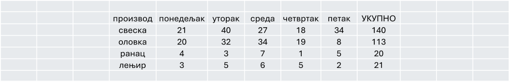
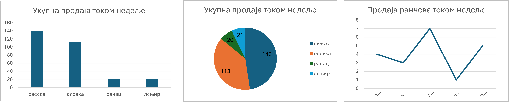

# Представљање података

## Обична табела

Најједноставнији начин да уредимо и прикажемо податке јесте да их прикажемо **табелом**.
Редови представљају појединачне ставке (на пример производе, запослене или месеце), а колоне њихове особине (продата количина, остварен приход и сл.).

Табеле су посебно корисне када:

- желимо да прикажемо прецизне вредности,

- упоређујемо више категорија истовремено,

- тражимо конкретан податак.

Узмимо за пример мало предузеће које продаје школски прибор. На крају недеље направљена је табела у којој пише колико је продато свезака, оловака, ранчева и лењира. Док су ти подаци само појединачни рачуни, тешко можемо да стекнемо утисак о продаји. Али када их саберемо и прикажемо у табели, лако долазимо до закључка који се производ највише продаје, а који најмање.

На пример: продато је 140 свезака, 113 оловака, 20 ранчева и 21 лењир. Све је јасно и прегледно на једном месту.



## Графикони — подаци који се виде

Иако табела садржи тачне бројеве, много брже разумемо податке када их прикажемо као **графикон**.

Разликујемо неколико врста графикона. Основни и најчешће коришћени су:

- **Стубичасти графикон** нам омогућава да одмах уочимо који се производ најбоље продаје.

- **Пита (кружни) графикон** показује колики је удео сваког производа у укупној продаји.

- **Линијски графикон** бисмо користили када бисмо пратили како се продаја мењала из недеље у недељу или из месеца у месец.



```{infonote}
**Поређење категорија → стубичасти графикон**

**Део у односу на целину → пита графикон**

**Промена кроз време → линијски графикон**
```

**Ако нисте сигурни - стубичасти графикон је скоро увек добар избор!**


