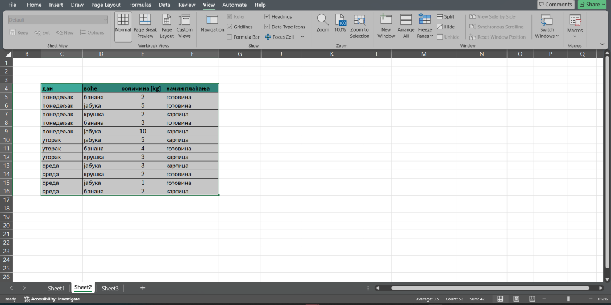
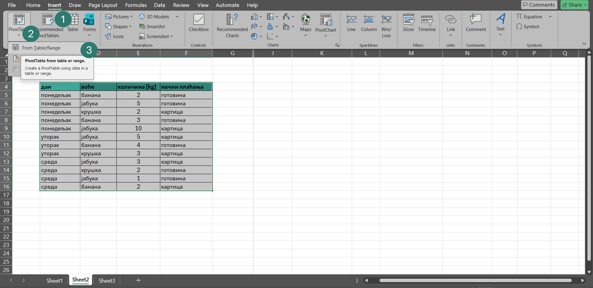
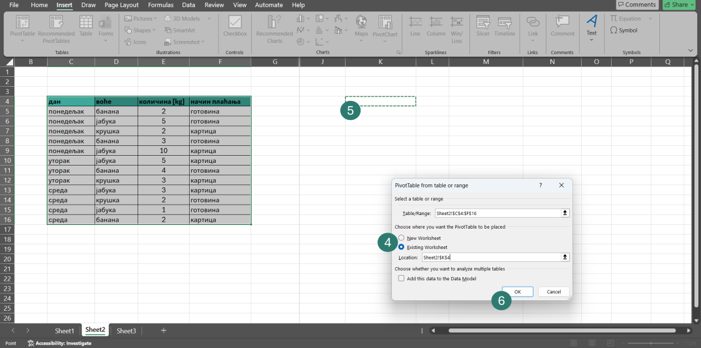
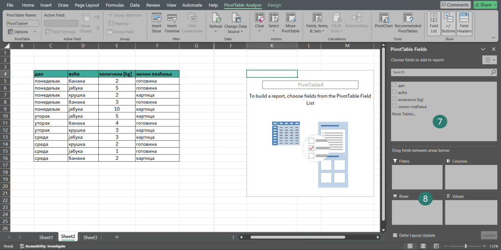
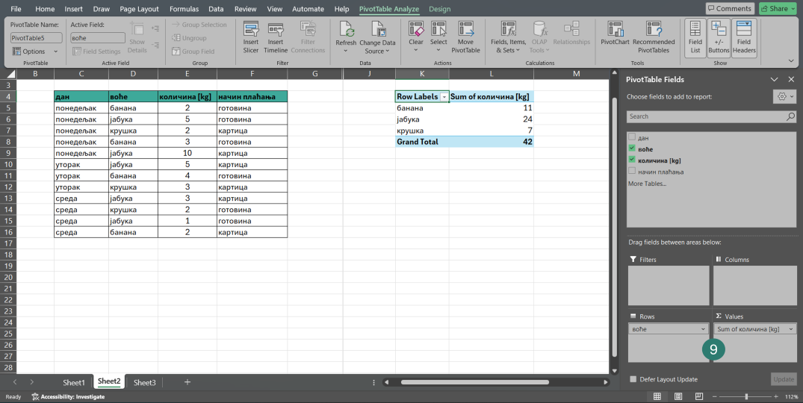
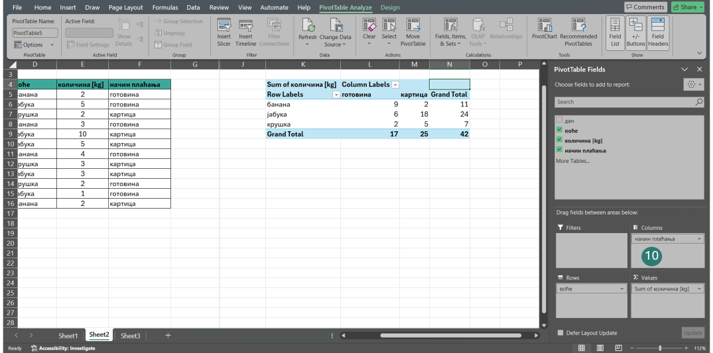
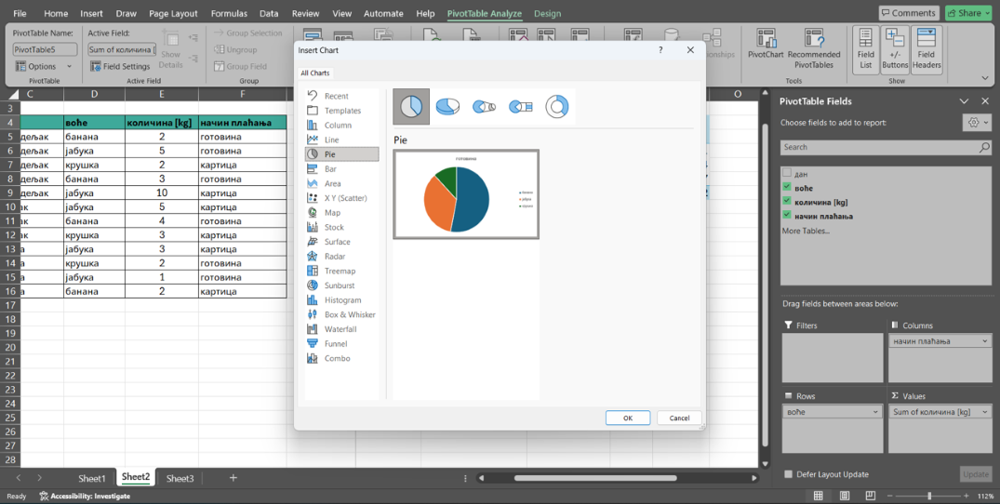
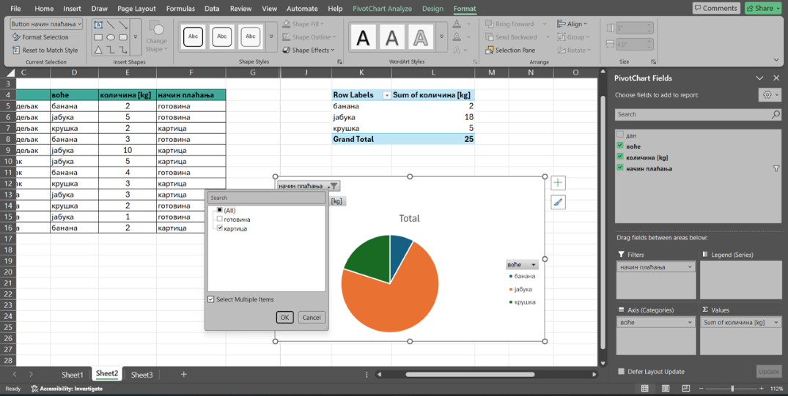

# Како направити пивот табелу?

```{infonote}
**Четири основна елемента пивот табеле**

- **Редови (*Rows*)** - Категорије које се приказују са леве стране табеле.
- **Колоне (*Columns*)** - Категорије које се приказују у горњем делу табеле.
- **Вредности (*Values*)** - Бројеви који се израчунавају (збир, број, просек…).
- **Филтери (*Filters*)** - Омогућавају приказ само дела података.
```

## Креирање пивот табеле - корак по корак

### Корак 1: Означите табелу са подацима
Кликните на било коју ћелију табеле и на тастатури притисните комбинацију тастера *Ctrl + A*



### Корак 2: Покрените креирање пивот табеле
Кликните на *Insert* (1), *PivotТable* (2) и изаберите опцију *From Table/Range* (3)



### Корак 3: Изаберите где желите да се нађе ваша пивот табела
Можете да изаберете нови радни лист (*New Worksheet*) или локацију на истом радном листу (*Existing Worksheet*) (4) (у том случају потребно је да кликнете на ћелију у оквиру које ће се наћи горњи леви угао ваше пивот табеле) (5). Потврдите кликом на *Ok*. (6)



### Корак 4: Упознајте едитор пивот табела
Подешавања пивот табеле вршите превлачењем поља (7) у одређене зоне (8).



### Корак 5: Додајте редове (*Rows*) и вредности (*Values*)
За први пример из увода у зону *Rows* превукли смо поље *воће*. У зону *Values* превукли смо поље *количина [kg]*




```{infonote}
Начин израчунавања у области Values можемо променити преко опције Value Field Settings. Поред подразумеваног збира (Sum), доступни су и Average (просек), Count (број уноса), Min и Max. Важно је знати да ће, уколико се у област Values постави текстуално поље, пивот табела уместо збира аутоматски приказати број појављивања тог текста (Count).
```

### Корак 7: Додајте колоне (опционо)
Табелу у којој се види и на који начин су купци плаћали добили смо додавањем поља *начин плаћања* у зону Колоне (*Columns*) (10)



```{infonote}
Уколико се деси да вам се затворио прозор са десне стране који омогућава подешавање приказа пивот табеле, можете га поново отворити тако што ћете кликнути на било коју ћелију пивот табеле и изабрати опцију Show field list.
```
### Корак 8: Додајте филтере (опционо)
Додавање филтера омогућиће вам да из велике количине података брзо издвојите и прикажете само оне вредности које су вам у датом тренутку потребне, без измене почетне табеле и додатних прорачуна. 

```{infonote}
Иако је пивот табела повезана са оригиналном табелом, измене у њој се не ажурирају аутоматски. Након сваке измене потребно је десним кликом на пивот табелу изабрати опцију Refresh, како би се сви резултати освежили.
```
## Пивот графикон

Подаци из пивот табеле могу се приказати и графички. На тај начин резултати постају прегледнији и лакше се уочавају разлике и односи.

Пивот графикон се прави на следећи начин:

Кликните унутар пивот табеле и из менија изаберите опцију *PivotChart*. Одаберите тип графикона и потврдите избор.



```{infonote}
Графикон је повезан са пивот табелом, што значи да се свака промена у табели аутоматски приказује и на графикону. Приликом графичког приказа, предности примене филтера посебно долазе до изражаја.
```
